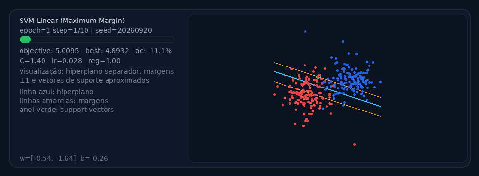
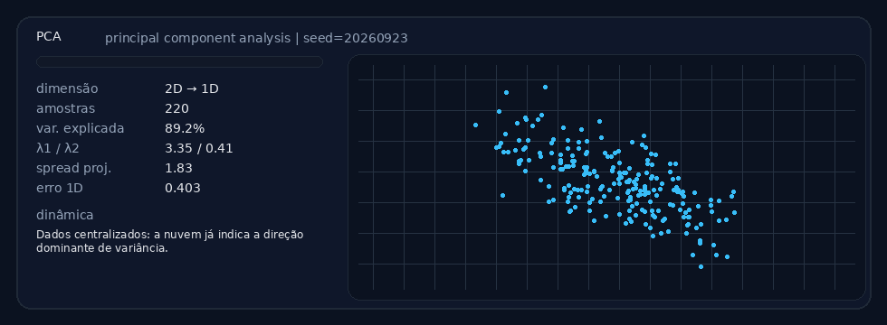
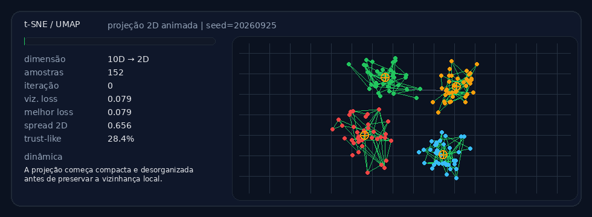
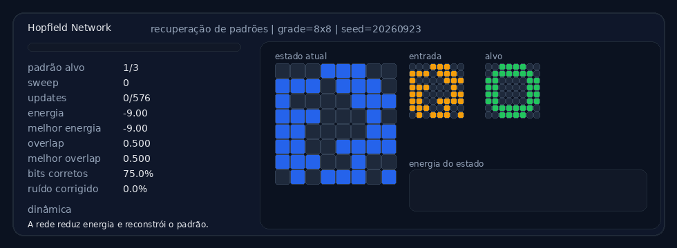

## Algoritmos clássicos de Inteligência Artificial em ação

Neste perfil, compartilho **visualizações animadas de algoritmos fundamentais de Inteligência Artificial e Machine Learning**.

A ideia é mostrar, de forma didática, **como cada algoritmo evolui ao longo do tempo** — encontrando caminhos, separando classes, organizando clusters ou projetando dados de alta dimensão.

Os GIFs são gerados automaticamente por **scripts Python** e atualizados periodicamente via **GitHub Actions**.

---

## 🔎 Busca

### A* (pathfinding)


---

## 🤖 Aprendizado supervisionado

### Perceptron (primeira rede neural)


### Gradient Descent (logistic regression)


### Gaussian Naive Bayes


### SVM (maximum margin)


### Decision Tree


---

## 🧠 Aprendizado não supervisionado

### K-Means (clusterização)


### Self-Organizing Map (SOM)


### PCA (Principal Component Analysis)


### t-SNE / UMAP (projeção 2D)


---

## 🧬 Computação evolutiva

### Genetic Algorithm (Rastrigin optimization)


---

## 🧩 Redes neurais clássicas

### Hopfield Network (recuperação de padrões)


---

## Como os GIFs são gerados

Todos os GIFs são produzidos automaticamente por scripts Python em:

```
scripts/
```

Os resultados são exportados para:

```
assets/
```

A atualização ocorre automaticamente através de:

```
.github/workflows/
```

Veja também: [Roadmap de futuras visualizações](./ROADMAP.md)

---

## Objetivo

Construir uma **coleção visual de algoritmos fundamentais de Inteligência Artificial**, útil para:

- ensino de Machine Learning
- visualização de conceitos algorítmicos
- documentação técnica
- exploração educacional de IA

---

> **“O humano sente para compreender porque precisa,  
> a IA compreende sem sentir porque pode.”**  
> — *Douglas Baldon*
