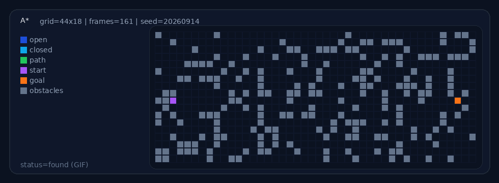
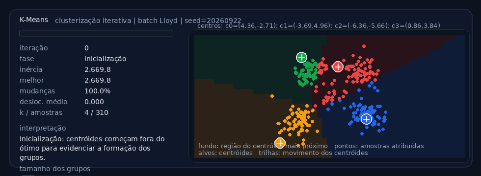
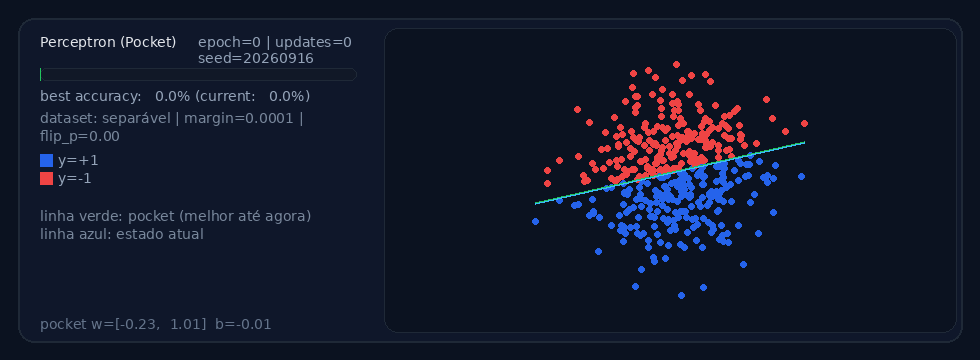
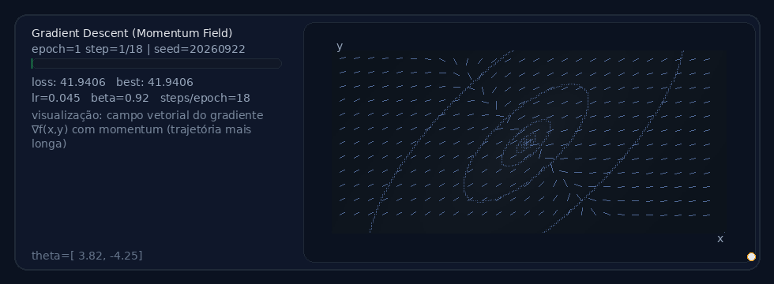
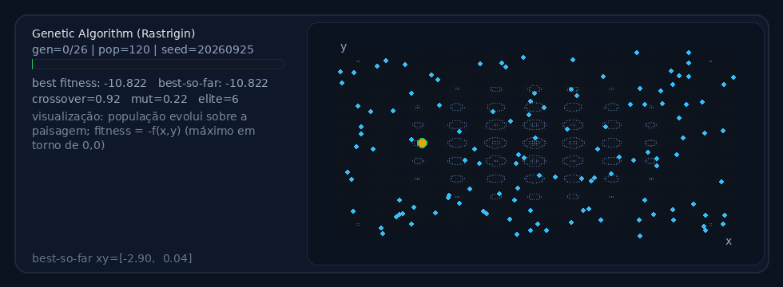
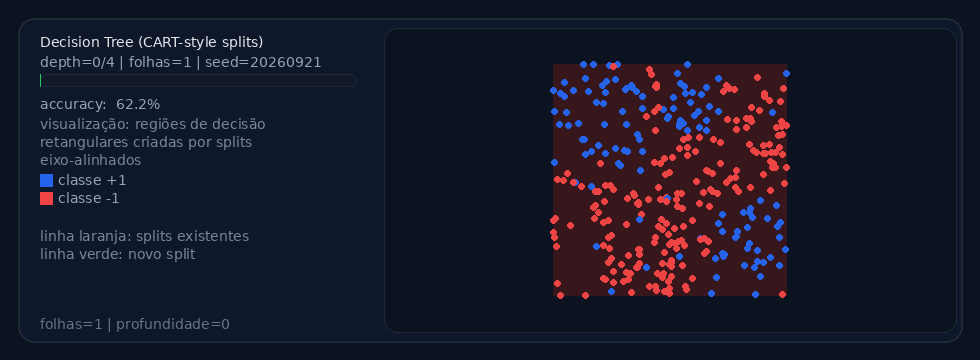
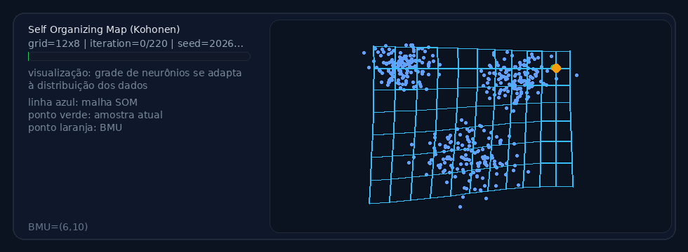
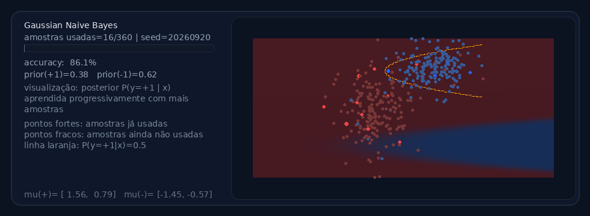

## Visualizações algorítmicas (geradas automaticamente)

### A* (busca de caminho)

### K-means (clusterização)

### Perceptron (primeira rede neural)

### Gradient Descent (logistic regression)

## Genetic Algorithm (rastrigin)

### Decision Tree

### Self-Organizing Map (SOM)

### Gaussian Naive Bayes
